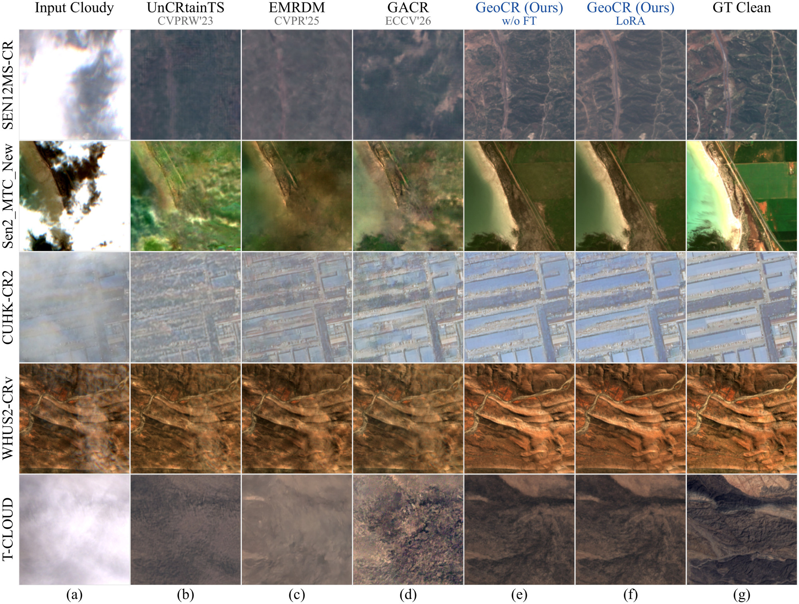
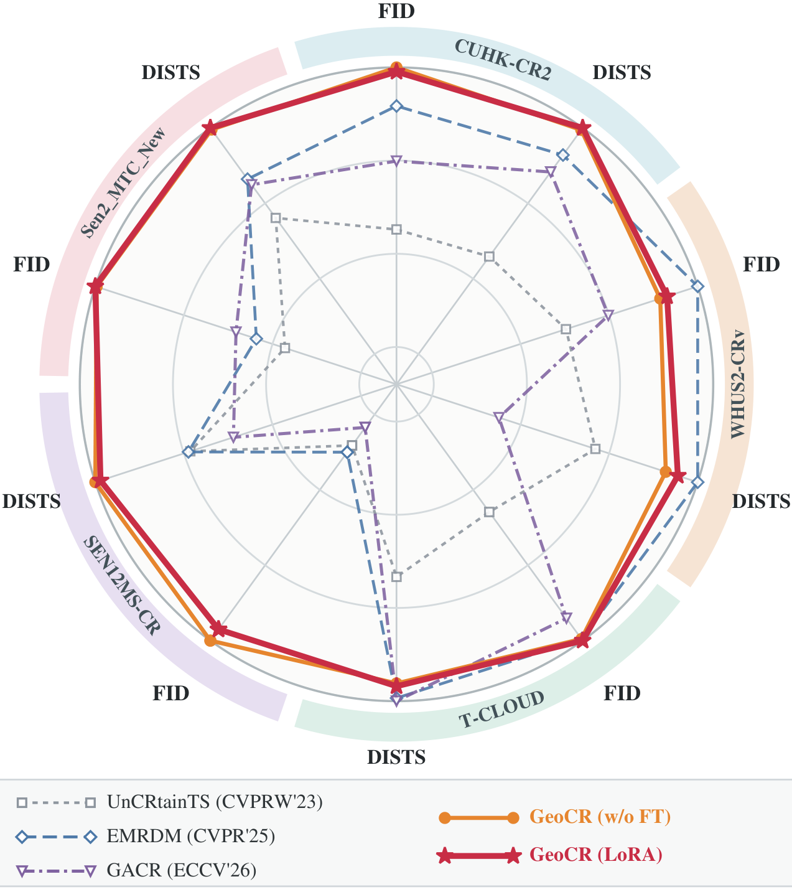
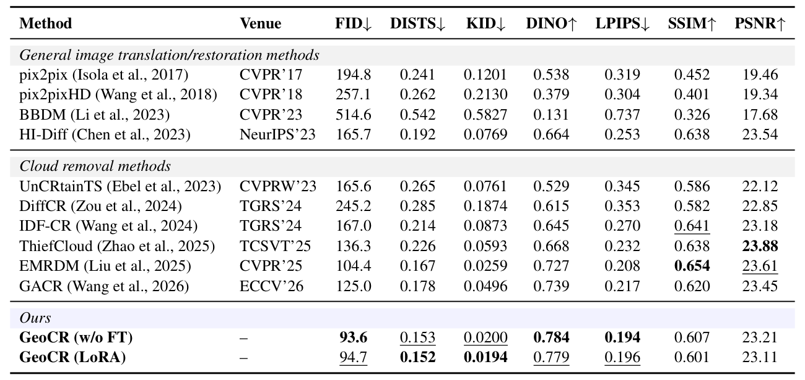
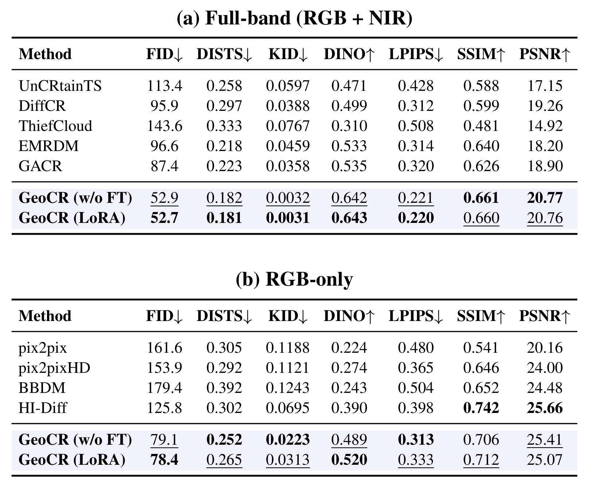
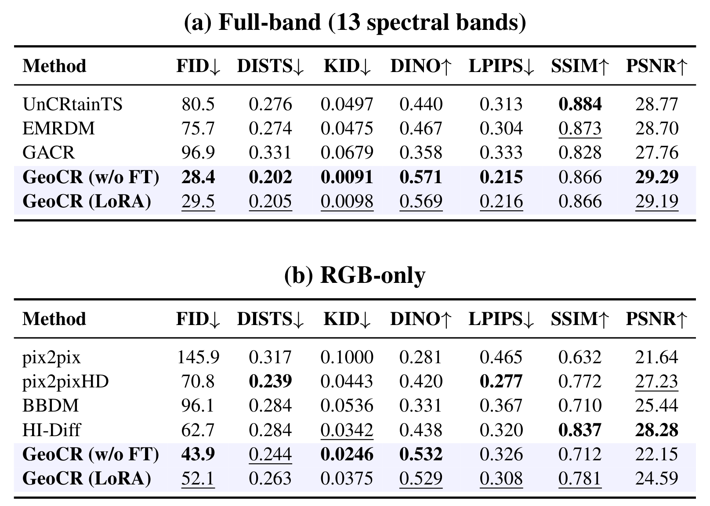
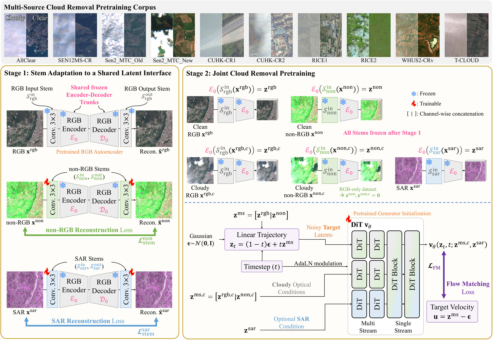

<p align="center">
  <picture>
    <source media="(prefers-color-scheme: dark)" srcset="assets/logo_dark.svg">
    
  </picture>
</p>

<div align="center">
<h2>GeoCR: Learning a Generalist Cloud Removal Prior from Heterogeneous Observations</h2>
<div>
    <a href='https://jeonghyeokdo.github.io/' target='_blank'>Jeonghyeok Do</a>&nbsp;&nbsp;&nbsp;&nbsp;
    <a href='https://www.viclab.kaist.ac.kr/' target='_blank'>Munchurl Kim</a><sup>†</sup>
</div>
<div>
    Korea Advanced Institute of Science and Technology (KAIST), South Korea
</div>
<div>
    <sup>†</sup>Corresponding author
</div>
<div>
    <h4 align="center">
        <a href="https://kaist-viclab.github.io/GeoCR_site/" target='_blank'>
        
        </a>
        <!-- ARXIV_BADGE_START --><a href="https://arxiv.org/abs/2609.32510" target="_blank"></a><!-- ARXIV_BADGE_END -->
        <a href="https://huggingface.co/JeonghyeokDo/GeoCR" target="_blank"></a>
        
    </h4>
</div>
</div>

---

<div align="center">
    <h4>
        This repository is the official implementation of "GeoCR: Learning a Generalist Cloud Removal Prior from Heterogeneous Observations".
    </h4>
</div>

## 📧 News
- **Oct 2026:** Code, pretrained weights, LoRA adapters and the retrained comparison methods are released.
- **Sep 2026:** This repository is created.

## 📖 Abstract
Cloud removal methods are typically specialized to individual datasets and input configurations, limiting reuse across sensors, spectral bands, and observation settings. We introduce **GeoCR**, a generalist model that unifies RGB-only-based CR and multispectral-based CR from single- or multi-temporal cloudy observations, with optional SAR guidance, within a single network. To accommodate different spectral and sensing domains, compact input and output stems extend a pretrained RGB autoencoder while keeping its encoder and decoder trunks frozen. This shared latent interface enables a single flow transformer to jointly model clean RGB and non-RGB latents, conditioned on separate cloudy-observation streams and optional SAR tokens. Through joint pretraining on the training splits of ten datasets comprising 883,331 cloud-free target images, GeoCR learns a *shared cloud removal prior* across these heterogeneous configurations. The same pretrained checkpoint supports direct inference without dataset-specific fine-tuning and efficient adaptation through low-rank adaptation (LoRA). We evaluate GeoCR against general image restoration and cloud removal methods on test splits of the contributing datasets under full-band and RGB-only settings. GeoCR achieves the best FID and DISTS on full-band SEN12MS-CR and Sen2_MTC_New and RGB-only CUHK-CR2, outperforming existing models and demonstrating the effectiveness of a reusable generative model across diverse settings.

## 📊 Results

### Qualitative Comparison
<div align="center">
    
</div>
<p align="center"><em><b>Qualitative comparison on cloud-removal benchmarks.</b> (a) Input cloudy, (b) UnCRtainTS, (c) EMRDM, (d) GACR, (e) GeoCR without fine-tuning, (f) GeoCR with LoRA adaptation, and (g) ground-truth cloud-free image.</em></p>

### Cross-Dataset Comparison
GeoCR achieves the best FID and DISTS on full-band Sen2_MTC_New and SEN12MS-CR and RGB-only CUHK-CR2.

<div align="center">
    
</div>
<p align="center"><em>FID and DISTS on the five primary benchmarks, normalized for each dataset–metric pair as 100 × best/value (larger is better).</em></p>

### Quantitative Comparison
**Bold** and <ins>underlined</ins> values indicate the best and second-best results.

<p align="center"><em><b>Table 2: Quantitative comparison on CUHK-CR2.</b> Its RGB evaluation setting supports both RGB-only image translation/restoration methods and specialized cloud removal methods, enabling comparison across all ten baselines.</em></p>
<div align="center">
    
</div>
<br>
<p align="center"><em><b>Table 3: Quantitative comparison on Sen2_MTC_New.</b> (a) Full-band setting. (b) RGB setting.</em></p>
<div align="center">
    
</div>
<br>
<p align="center"><em><b>Table 4: Quantitative comparison on SEN12MS-CR.</b> (a) Full-band setting. (b) RGB setting.</em></p>
<div align="center">
    
</div>
<br>

**Please visit our [project page](https://kaist-viclab.github.io/GeoCR_site/) for the interactive comparison and more results.**

## 🖼️ Method Overview

<div align="center">
    
</div>
<p align="center"><em><b>GeoCR framework.</b> A shared latent interface enables joint cloud removal across heterogeneous spectral, temporal, and SAR configurations.</em></p>

- **Shared latent interface:** compact stems map non-RGB and SAR inputs into a frozen pretrained RGB autoencoder.
- **One generalist prior:** a single flow transformer is jointly pretrained on 10 datasets (883,331 cloud-free targets).
- **Two modes:** the same checkpoint is used directly (**GeoCR (w/o FT)**) or adapted with LoRA (**GeoCR (LoRA)**).

## 🚀 Code Release
- ✅ Inference code
- ✅ Training scripts (Stage 1 stems, Stage 2 pretraining, LoRA)
- ✅ Evaluation scripts
- ✅ Pretrained weights and LoRA adapters
- ✅ Comparison methods: code, configurations and weights

## 🤗 Model Weights

All weights are on the Hugging Face Hub at [JeonghyeokDo/GeoCR](https://huggingface.co/JeonghyeokDo/GeoCR).

| Component | Hub path |
|---|---|
| **GeoCR (w/o FT)**: the Stage 2 flow transformer (3.853B parameters) | `transformer/` |
| **GeoCR (LoRA)**: one adapter per evaluation setting (23.1M parameters each) | `lora/<dataset>/` |
| Stage 1 stems (ten-band TOA, ten-band BOA, NIR, SAR) | `stems/stems.safetensors` |
| Frozen FLUX.2 autoencoder | `vae/ae.safetensors` |
| Retrained comparison methods | `baselines/<dataset>/<method>/` (see [MODEL_ZOO.md](MODEL_ZOO.md)) |

LoRA adapters are provided for `sen12ms-cr`, `sen2-mtc-new`, `whus2-crv`, `t-cloud`, `cuhk-cr1`, `cuhk-cr2` and the
RGB-only settings `sen12ms-cr-rgb`, `sen2-mtc-new-rgb`, `whus2-crv-rgb`. The commands below expect the weights in
`weights/` with the Hub layout:

```bash
hf download JeonghyeokDo/GeoCR --exclude "baselines/*" --local-dir weights
```

## ⚙️ Installation

```bash
git clone https://github.com/KAIST-VICLab/GeoCR.git
cd GeoCR
conda create -n geocr python=3.12 -y
conda activate geocr
pip install torch==2.11.0 torchvision==0.26.0 --index-url https://download.pytorch.org/whl/cu128
pip install -r requirements.txt
```

All commands are run from the repository root.

## 🗂️ Data Preparation

GeoCR is pretrained on the training splits of ten datasets and evaluated on the test splits of SEN12MS-CR,
Sen2_MTC_New, WHUS2-CRv, T-CLOUD, CUHK-CR1 and CUHK-CR2, plus RGB-only settings of SEN12MS-CR, Sen2_MTC_New and
WHUS2-CRv. **[DATA.md](DATA.md)** gives the download link of each dataset, the directory layout, the preparation
commands, the split checks, the pretraining mixture and the evaluation settings. In short:

```bash
export CR_DATASETS=/path/to/datasets      # one folder per dataset, laid out as in DATA.md
export CR_EXPORTS=/path/to/exports        # rendered PNG copies
cp -r splits/*/ "$CR_DATASETS"/           # frozen split lists
python -m geocr.data.exporters.export_rgbvariant --out "$CR_EXPORTS"            # RGB-only settings
python -m geocr.data.exporters.export_display8 --out "$CR_EXPORTS" --aliases    # comparison methods only
```

## 🚀 Inference

```bash
# GeoCR (w/o FT): the pretrained checkpoint, used directly
python -m geocr.infer --dataset sen12ms-cr --weights weights --out outputs/sen12ms-cr/wo-ft
# GeoCR (LoRA): the same checkpoint with the adapter of the dataset
python -m geocr.infer --dataset sen12ms-cr --weights weights --lora sen12ms-cr --out outputs/sen12ms-cr/lora
```

`--dataset` is one of `sen12ms-cr`, `sen2-mtc-new`, `whus2-crv`, `t-cloud`, `cuhk-cr1`, `cuhk-cr2`,
`sen12ms-cr-rgb`, `sen2-mtc-new-rgb`, `whus2-crv-rgb`. Without `--weights`, the files are downloaded from the Hub.
`--lora` also accepts a checkpoint written by `geocr.train`. The output directory receives one `preds/<id>.npy` per
test image (CHW float32 in the dataset's value range) and a `manifest.json`.

Inference integrates the learned flow from Gaussian noise with four Euler steps on a uniform time grid, without
classifier-free guidance, with a fixed per-sample noise seed.

## 📏 Evaluation

```bash
python -m geocr.eval --dataset sen12ms-cr --pred outputs/sen12ms-cr/wo-ft \
  --dino-weights /path/to/dinov3_vitl16_pretrain_sat493m-eadcf0ff.pth --dino-repo /path/to/dinov3 \
  --out outputs/sen12ms-cr/wo-ft/results.json
# without the DINOv3 weights
python -m geocr.eval --dataset sen12ms-cr --pred outputs/sen12ms-cr/wo-ft --metrics fid,dists,kid,lpips,ssim,psnr
```

The evaluator follows Appendix G of the paper. FID, KID, DISTS, LPIPS and DINO similarity are computed on RGB
views; PSNR and SSIM use the bands of [Table 12](DATA.md#evaluation-settings), and CUHK-CR1 excludes the
duplicate images listed in [`splits/`](splits/). DINO similarity uses the frozen DINOv3-SAT ViT-L/16: request the
weights from [Meta](https://github.com/facebookresearch/dinov3) (DINOv3 License) and pass a clone of the DINOv3
repository with `--dino-repo`. The same command scores the predictions of the comparison methods.

## 🏋️ Training

**Stage 1: stems.** The ten-band TOA stem and the SAR stem are trained on AllClear, and the ten-band BOA stem on
WHUS2-CRv, around the frozen FLUX.2 autoencoder:

```bash
torchrun --nproc_per_node=2 -m geocr.stems toa --root "$CR_DATASETS/AllClear" \
  --ae weights/vae/ae.safetensors --out runs/stems_toa
python -m geocr.stems boa --root "$CR_DATASETS/WHUS2-CRv/extracted" --ae weights/vae/ae.safetensors \
  --init runs/stems_toa/stems.safetensors --out runs/stems
```

**Stage 2: pretraining.** The flow transformer is initialised from FLUX.2 [klein] 4B Base and trained on the
ten-dataset mixture of [`configs/pretrain.yaml`](configs/pretrain.yaml):

```bash
hf download black-forest-labs/FLUX.2-klein-base-4B flux-2-klein-base-4b.safetensors --local-dir weights/klein
torchrun --nproc_per_node=4 -m geocr.train configs/pretrain.yaml model.stems_path=runs/stems/stems.safetensors
```

**LoRA.** Adapters start from the released Stage 2 checkpoint (`weights/transformer`); one config per dataset is
in [`configs/lora/`](configs/lora/):

```bash
python -m geocr.train configs/lora/sen12ms-cr.yaml
python -m geocr.infer --dataset sen12ms-cr --weights weights --lora runs/lora/sen12ms-cr/ckpt_final.pt \
  --out outputs/sen12ms-cr/my-lora
```

Any config value can be overridden on the command line with a dotted key, for example
`train.output_dir=runs/lora/my-run`.

## 🔁 Comparison Methods

The ten comparison methods are retrained on each dataset's training split using the official implementations and
evaluated with the same pipeline. [`baselines/`](baselines/) holds, for each method, a patch against the pinned
upstream commit, the configurations and the training and inference scripts. The checkpoints are on the Hub under
`baselines/`, listed in [MODEL_ZOO.md](MODEL_ZOO.md).

## 📁 Repository Structure

```text
GeoCR/
├── geocr/
│   ├── models/        GeoCR flow transformer, FLUX.2 blocks and autoencoder, stems, codec
│   ├── flows/         rectified flow: time sampling, loss, Euler sampler
│   ├── data/          dataset readers, pretraining mixture, AllClear preparation, exporters
│   ├── metrics/       PSNR/SSIM of each evaluation setting
│   ├── eval/          python -m geocr.eval
│   ├── stems.py       Stage 1 training
│   ├── train.py       Stage 2 pretraining and LoRA training
│   ├── infer.py       inference
│   └── lora.py, obs_pack.py, config.py, normalize.py
├── configs/           pretrain.yaml, lora/<dataset>.yaml
├── splits/            frozen split lists and split-check files
├── baselines/         the ten comparison methods
├── DATA.md            datasets, preparation, split checks, evaluation settings
└── MODEL_ZOO.md       results of the paper with the corresponding weights
```

## 📑 Citation
If you find GeoCR useful, please consider citing:
```BibTeX
@article{do2026geocr,
  title={GeoCR: Learning a Generalist Cloud Removal Prior from Heterogeneous Observations},
  author={Do, Jeonghyeok and Kim, Munchurl},
  journal={arXiv preprint arXiv:2609.32510},
  year={2026}
}
```
## 📜 License

The code is released under the [Apache License 2.0](LICENSE); third-party notices are in [NOTICE](NOTICE). The
model weights are released under the terms in [LICENSE-WEIGHTS.md](LICENSE-WEIGHTS.md). The datasets are not
redistributed here; each is subject to the terms of its distributor (see [DATA.md](DATA.md)).
